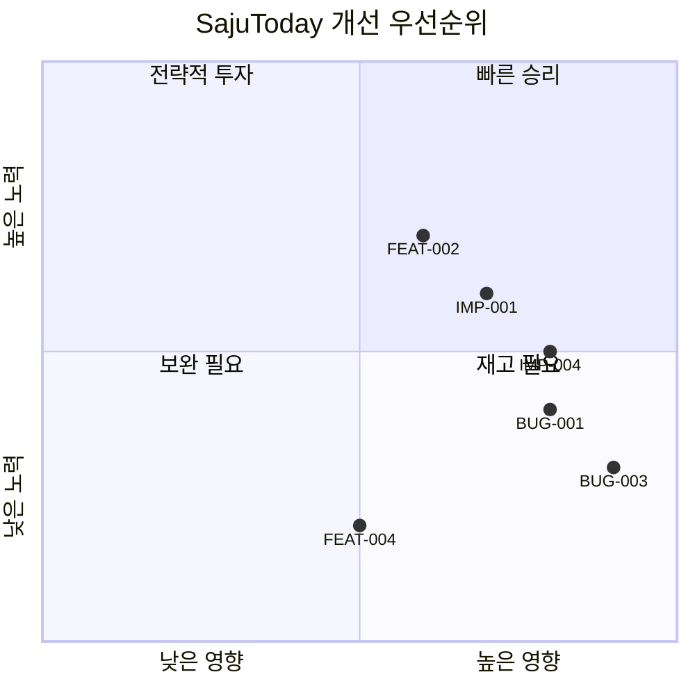
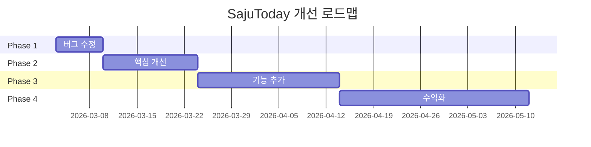

# 🎯 SajuToday 종합 개선 기획안

> 작성일: 2026-03-02
> 목적: 앱 개선점, 기능 추가, 버그 수정을 종합하여 기획

---

## 📊 프로젝트 현황 요약

### 앱 개요
- **프로젝트명**: SajuToday (사주투데이)
- **플랫폼**: Android (Expo/React Native)
- **타깃**: 한국 사용자 (20-50대)
- **핵심 기능**: 사주 계산, 일일 운세, 궁합 분석

### 화면 구성 (35개 스크린)
```
온보딩 → 메인 (운세) → 사주 상세 → 설정
         ├─ 캘린더
         ├─ 궁합
         ├─ 대운
         ├─ 신살
         ├─ 꿈일지
         ├─ 가족그룹
         └─ 기타 메뉴
```

---

## 🚨 1. 버그 수정 (Bug Fixes)

### 1.1 Critical (즉시 수정 필요)

#### BUG-001: 입춘(立春) 경계 처리 부정확
- **위치**: [`SajuCalculator.ts:96-115`](src/services/SajuCalculator.ts:96)
- **문제**: 입춘 날짜를 2월 4일로 고정 (실제는 2월 3~5일 변동)
- **영향**: 입춘 전후 생일자의 년주 잘못 계산
- **해결방안**: KASI API에서 절기 정보 동적 조회

```typescript
// 개선 방향
const solarTerms = await KasiService.getSolarTerms(year);
const ipchunDate = solarTerms.find(s => s.name === '입춘')?.date;
```

#### BUG-002: 월주 절기 계산 부정확
- **위치**: [`SajuCalculator.ts:146-173`](src/services/SajuCalculator.ts:146)
- **문제**: 절기 날짜 고정값 사용 (실제는 매년 변동)
- **영향**: 절기 경계일 생일자의 월주 오차 (±1일)
- **해결방안**: KASI API 연동 또는 정확한 절기 테이블 적용

### 1.2 High (높은 우선순위)

#### BUG-003: API 키 클라이언트 노출
- **위치**: [`KasiService.ts:14`](src/services/KasiService.ts:14)
- **문제**: `EXPO_PUBLIC_*` 환경변수가 클라이언트에 노출
- **영향**: API 키 탈취, 과다 호출 악용 가능
- **해결방안**:
  - 프록시 서버 구축 (Cloudflare Workers / Vercel Functions)
  - API 키 서버 이관

#### BUG-004: 잘못된 음력 날짜 표시
- **위치**: [`dateFormatter.ts:45-52`](src/utils/dateFormatter.ts:45)
- **문제**: 양력 날짜를 음력이라고 표시 (실제 변환 안 함)
- **영향**: 사용자에게 잘못된 정보 제공
- **해결방안**: KASI API로 실제 음력 변환 수행

#### BUG-005: 네비게이션 파라미터 타입 불일치
- **위치**: HomeScreen → DatePickerScreen 간 파라미터 전달
- **문제**: 함수를 파라미터로 전달하여 메모리 누수 가능
- **해결방안**: 콜백 패턴 대신 이벤트/상태 관리 사용

### 1.3 Medium (중간 우선순위)

#### BUG-006: SQLite any 타입 사용
- **위치**: [`StorageService.ts:44`](src/services/StorageService.ts:44)
- **문제**: `db: any` 타입으로 타입 안전성 상실
- **해결방안**: `SQLite.SQLiteDatabase | null` 타입 적용

#### BUG-007: 안전하지 않은 UUID 생성
- **위치**: [`OnboardingScreen.tsx:24-30`](src/screens/OnboardingScreen.tsx:24)
- **문제**: `Math.random()` 사용 (암호학적으로 안전하지 않음)
- **해결방안**: `crypto.getRandomValues()` 또는 uuid 라이브러리 사용

#### BUG-008: 중복 사주 계산
- **위치**: HomeScreen의 useMemo
- **문제**: 저장된 사주 결과가 있어도 재계산 수행
- **해결방안**: 저장된 결과 우선 사용, 없을 때만 계산

### 1.4 Low (낮은 우선순위)

#### BUG-009: 과도한 useMemo 사용
- **위치**: HomeScreen (20개 이상)
- **영향**: 메모리 사용량 증가, 코드 복잡성
- **해결방안**: 필요한 경우만 사용, React Compiler 검토

#### BUG-010: NetInfo 리스너 메모리 누수 가능
- **위치**: [`KasiService.ts:71-84`](src/services/KasiService.ts:71)
- **해결방안**: 앱 라이프사이클에 맞춘 구독 해제

---

## ✨ 2. 기능 개선 (Improvements)

### 2.1 사주 상세 화면 개선

#### IMP-001: 일간 강약 분석 상세화
- **위치**: [`SajuScreen.tsx:675-720`](src/screens/SajuScreen.tsx:675)
- **현재**: 점수 + 신강/신약만 표시
- **개선 내용**:
  - 판단 근거(reasons) 리스트 표시
  - 성향 특징 추가
  - 조언 텍스트 추가

```
📊 일간 강약 분석 (65점 - 보통)

[강약 게이지]
약 ◀━━━━━━━●━━━━━━━━━▶ 강
        65%

[판단 근거]
✓ 월지(인)의 계절 기운이 일간을 도움 (+15점)
✓ 일간 오행(목)이 사주 내에서 강함 (+15점)
```

#### IMP-002: 오행 균형 섹션 신규 추가
- **새 컴포넌트**: `ElementBalanceChart.tsx`
- **기능**:
  - 5행 막대 그래프 (목화토금수)
  - 각 오행 비율 % 표시
  - 용신 오행 ★ 마크 강조
  - 과다/적정/부족 상태 표시

#### IMP-003: 용신/기신 생활 적용 가이드
- **개선 내용**:
  - 추천 색상 (색상명, hex 코드, 활용법)
  - 추천 방위 (방위, 각도, 활용법)
  - 행운의 숫자
  - 추천 활동
  - 피해야 할 것

### 2.2 운세 시스템 개선

#### IMP-004: EASY_DAY_RELATIONS 데이터 채우기
- **위치**: [`fortuneMessages.ts:31`](src/data/fortuneMessages.ts:31)
- **현재**: 빈 객체 `{}`
- **개선**: 5일간 × 5오늘오행 = 25가지 조합 데이터 추가
- **내용**: 각 조합별 title, summary, detailed, situations, doThis, avoidThis, keywords

#### IMP-005: 운세 메시지 다양화
- **문제**: 60일 주기로 같은 간지 반복, 비슷한 운세
- **해결방안**:
  - 연도 기반 시드 이미 적용됨 (확인 완료)
  - 메시지 풀 확장
  - 계절/절기 반영

### 2.3 UI/UX 개선

#### IMP-006: 오프라인 모드 강화
- **문제**: KASI API 실패 시 계산 불가
- **해결방안**:
  - 음력→양력 변환표 로컬 캐싱
  - 절기 데이터 로컬 저장
  - 오프라인 상태 표시 UI

#### IMP-007: 접근성 개선
- 스크린 리더 지원 강화
- 색상 대비 개선
- 폰트 크기 조절 지원

---

## 🆕 3. 신규 기능 (New Features)

### 3.1 사용자 요청 가능성 높은 기능

#### FEAT-001: 푸시 알림 고도화
- **현재**: 기본 알림만 존재
- **추가 내용**:
  - 운세 알림 (매일 설정 시간)
  - 특일 알림 (입춘, 절기 등)
  - 대운 변화 알림
  - 알림 내용 미리보기

#### FEAT-002: 운세 공유 기능
- **기능**:
  - 오늘 운세 카드 이미지 생성
  - SNS 공유 (카카오톡, 인스타그램 등)
  - 공유용 문구 자동 생성

#### FEAT-003: 데이터 백업/복구
- **기능**:
  - 클라우드 백업 (Google Drive)
  - 기기 변경 시 데이터 이관
  - 자동 백업 설정

#### FEAT-004: 프리미엄 기능 (수익화)
- **기능**:
  - 상세 사주 해석 (유료)
  - 월간/연간 운세 (유료)
  - 전문가 상담 연결 (제휴)
  - 광고 제거

### 3.2 차별화 기능

#### FEAT-005: AI 상담 챗봇
- **기능**:
  - 사주 관련 질문 답변
  - 개인화된 조언 제공
  - 대화 기록 저장

#### FEAT-006: 커뮤니티 기능
- **기능**:
  - 운세 후기 공유
  - 같은 일주 모임
  - 익명 게시판

#### FEAT-007: 워치 앱 연동
- **기능**:
  - 오늘 운세 위젯
  - 간단한 운세 확인
  - 알림 수신

---

## 📋 4. 우선순위 매트릭스



### 4.1 Phase 1: 긴급 수정 (1주)
| 항목 | 내용 | 예상 난이도 |
|------|------|------------|
| BUG-001 | 입춘 경계 처리 | 중 |
| BUG-002 | 월주 절기 계산 | 중 |
| BUG-003 | API 키 보안 | 높음 |
| IMP-004 | EASY_DAY_RELATIONS 데이터 | 낮음 |

### 4.2 Phase 2: 핵심 개선 (2주)
| 항목 | 내용 | 예상 난이도 |
|------|------|------------|
| IMP-001 | 일간 강약 분석 상세화 | 중 |
| IMP-002 | 오행 균형 섹션 | 중 |
| IMP-003 | 용신/기신 가이드 | 중 |
| BUG-004 | 음력 변환 수정 | 낮음 |

### 4.3 Phase 3: 기능 추가 (3주)
| 항목 | 내용 | 예상 난이도 |
|------|------|------------|
| FEAT-001 | 푸시 알림 고도화 | 중 |
| FEAT-002 | 운세 공유 기능 | 중 |
| IMP-006 | 오프라인 모드 | 높음 |

### 4.4 Phase 4: 수익화 (4주)
| 항목 | 내용 | 예상 난이도 |
|------|------|------------|
| FEAT-004 | 프리미엄 기능 | 높음 |
| FEAT-003 | 데이터 백업 | 높음 |
| FEAT-005 | AI 챗봇 | 높음 |

---

## 🛠️ 5. 기술적 개선사항

### 5.1 아키텍처 개선
- **상태 관리**: Context API → Zustand 또는 Redux Toolkit 검토
- **API 레이어**: React Query 도입으로 캐싱/재시도 자동화
- **에러 처리**: Error Boundary + 중앙 집중식 에러 로깅

### 5.2 성능 최적화
- **번들 크기**: 코드 스플리팅, 불필요한 라이브러리 제거
- **렌더링**: FlatList 가상화, memo 최적화
- **이미지**: WebP 변환, lazy loading

### 5.3 테스트 강화
- **단위 테스트**: 현재 4개 → 주요 서비스 커버리지 80% 목표
- **통합 테스트**: E2E 테스트 도입 (Detox)
- **CI/CD**: GitHub Actions 자동화

---

## 📊 6. 성공 지표 (KPI)

| 지표 | 현재 | 목표 |
|------|------|------|
| 일일 활성 사용자 (DAU) | - | +30% |
| 앱 평점 | - | 4.5+ |
| 크래시율 | - | <0.1% |
| 평균 세션 시간 | - | +20% |
| 프리미엄 전환율 | - | 5% |

---

## 📝 7. 실행 계획 요약



---

## ✅ 다음 단계

1. **사용자 검토**: 본 기획안 검토 및 피드백
2. **우선순위 조정**: 사용자 요구에 따른 순서 변경
3. **상세 설계**: 선택된 항목별 상세 기획서 작성
4. **개발 착수**: Code 모드로 전환하여 구현

---

*본 기획안은 BUG_REPORT.md, PROGRESS.md, SAJU_IMPROVEMENT_PLAN.md 등 기존 문서를 종합하여 작성되었습니다.*

---

## 🔍 8. 코드 대조 검증 및 보완 (Opus 4.6 분석)

> 분석일: 2026-03-02
> 방법: 기획안의 모든 버그/개선/기능 항목을 실제 소스코드와 1:1 대조 검증

---

### 8.1 버그 항목 검증 결과

| ID | 기획안 설명 | 판정 | 상세 |
|----|------------|------|------|
| **BUG-001** | 입춘 2월 4일 고정 | ⚠️ **부분 정확** | `getIpChunDay()` 메서드로 **2020~2034년은 동적 조회** (156-166줄). 범위 밖 연도만 기본값 4 사용. "고정"이라는 표현은 부정확 → **범위 밖 연도 기본값 4 사용** 이 정확 |
| **BUG-002** | 월주 절기 고정값 | ✅ **정확** | `getMonthIndexBySolarTerm()` (199-227줄)에서 `solarTermDays` 하드코딩. 주석에도 "KASI API 연동 권장" 명시 |
| **BUG-003** | API 키 클라이언트 노출 | ⚠️ **부분 정확** | 프록시 서버(`sajutoday-api.vercel.app`) 이미 도입됨. 다만 `API_KEY` (20줄)가 직접 호출 폴백에서 여전히 노출. **이미 부분 해결된 상태** |
| **BUG-004** | 양력을 음력이라고 표시 | ❌ **부정확** | `dateFormatter.ts:42-54` 실제 코드는 `return '음력 정보 (변환 필요)';` 반환. **양력을 음력으로 잘못 표시하는 게 아니라, 기능 자체가 미구현(TODO 상태)** |
| **BUG-005** | 네비게이션 함수 파라미터 전달 | ❌ **검증 불가** | **HomeScreen.tsx 파일이 존재하지 않음.** 메인 화면은 `DailyFortuneScreen`. DatePickerScreen은 문자열만 수신 (타입 안전). 기획안의 대상 파일명이 잘못됨 |
| **BUG-006** | SQLite `db: any` 타입 | ❌ **이미 수정됨** | `StorageService.ts:44`에서 `private static db: import('expo-sqlite').SQLiteDatabase \| null = null;` 으로 타입 명시 완료. 기획안 시점 이후 수정된 것으로 추정 |
| **BUG-007** | Math.random() UUID | ⚠️ **과장됨** | `OnboardingScreen.tsx:24-52`에서 **crypto.getRandomValues 우선 사용**, Math.random()은 폴백일 뿐. **이미 안전하게 구현됨.** 버그 아님 → 삭제 권장 |
| **BUG-008** | 중복 사주 계산 | ✅ **정확** | `calculateSaju()` (539줄)에서 매번 새 인스턴스 생성, 캐싱/메모이제이션 없음 |
| **BUG-009** | 과도한 useMemo (HomeScreen 20개) | ❌ **검증 불가** | **HomeScreen 파일 없음.** 실제 useMemo 최다 사용: `ProfileScreen` (12개), `LuckyItemsScreen` (8개). 대상 파일명/수량 모두 부정확 |
| **BUG-010** | NetInfo 리스너 메모리 누수 | ❌ **부정확** | `KasiService.ts:77-100` 검증 결과: 중복 호출 방지(`if (networkUnsubscribe) return;`) + 해제 함수(`stopNetworkListener`) 정확 구현. **메모리 누수 없음** → 삭제 권장 |

---

### 8.2 이미 수정 완료된 항목 (기획안 미반영)

기획안 작성 시점 이전에 이미 수정된 버그들이 기획안에 포함되지 않았거나, 반영이 필요합니다:

| 수정 항목 | 수정 파일 | 상태 |
|-----------|----------|------|
| **일진 계산 JDN 기반 전환** | `SajuCalculator.ts` (31-42줄), `MonthlyDailyFortune.ts` (57-65줄) | ✅ 수정 완료 |
| **toISOString UTC 날짜 밀림** | `CompatibilityInputScreen.tsx`, `SavedPeopleScreen.tsx`, `useTodayFortune.ts` | ✅ 수정 완료 |
| **음력→양력 변환 처리** | `CompatibilityInputScreen.tsx` (187, 315줄), `SavedPeopleScreen.tsx` | ✅ 수정 완료 |
| **해시 함수 음수 인덱스** | `useTodayFortune.ts:315` (`>>> 0` 적용) | ✅ 수정 완료 |

---

### 8.3 기획안 구조적 문제

#### 1) HomeScreen 참조 오류
기획안에서 `HomeScreen`을 여러 번 참조하지만, **실제 프로젝트에 HomeScreen.tsx는 존재하지 않습니다.**
- 메인 탭: `DailyFortuneScreen` (오늘), `SajuScreen` (사주), `FortuneMenuScreen` (운세), `CompatibilityScreen` (궁합), `MyScreen` (나)
- BUG-005, BUG-008, BUG-009의 대상 파일을 정확한 파일명으로 교정 필요

#### 2) 화면 수 불일치
기획안: "35개 스크린" → 실제 `src/screens/` 내 파일: **34개** (DatePickerTest.tsx 제외하면 33개 실사용)

#### 3) 삭제 권장 항목
- **BUG-007**: 이미 안전하게 구현됨 (crypto.getRandomValues 우선 사용)
- **BUG-010**: 메모리 누수 없음 (구독 해제 정확 구현)

#### 4) 심각도 재조정 필요
| ID | 현재 심각도 | 권장 심각도 | 이유 |
|----|------------|------------|------|
| BUG-001 | Critical | **Medium** | 2020-2034 범위 내에서는 정확. 범위 밖만 문제 |
| BUG-003 | High | **Medium** | 프록시 이미 적용, 직접 호출 폴백만 문제 |
| BUG-004 | High | **Medium** | 잘못 표시가 아닌 미구현. 현재는 "변환 필요" 표시 |
| BUG-007 | Medium | **삭제** | 이미 안전 구현됨 |
| BUG-010 | Low | **삭제** | 메모리 누수 없음 |

---

### 8.4 기획안에 누락된 실제 버그/이슈

| # | 누락 항목 | 위치 | 심각도 | 설명 |
|---|----------|------|--------|------|
| ~~**NEW-001**~~ | ~~`LUNAR_API_URL` 미정의~~ | `KasiService.ts:17` | ~~Medium~~ **해당없음** | ✅ **오판정**: 17줄에 `const LUNAR_API_URL = \`${KASI_BASE_URL}/LunCalInfoService\`` 정의됨. 528줄에서 정상 사용 중 |
| ~~**NEW-002**~~ | ~~`TaekilCalculator.ts` JDN 미수정~~ | `TaekilCalculator.ts:55-74` | ~~Medium~~ **해당없음** | ✅ **오판정**: `getJulianDayNumber`(55줄) + `JDN_GANJI_OFFSET=4`(65줄) 이미 적용됨 |
| **NEW-003** | `ProfileScreen` useMemo 12개 | `ProfileScreen.tsx:815-868` | Low | 기획안이 HomeScreen이라 잘못 명시. 실제 과다 사용 화면은 ProfileScreen |
| **NEW-004** | `formatLunarFromISO` TODO 미구현 | `dateFormatter.ts:42-54` | Medium | 음력 변환 함수가 상수 문자열만 반환. BUG-004의 정확한 재정의 |

---

### 8.5 개선/기능 항목 현황 (2026-03-02 코드 직접 확인)

| ID | 항목 | 현행 코드 상태 | 근거 |
|----|------|---------------|------|
| **IMP-001** | 일간 강약 분석 상세화 | ✅ **이미 구현됨** | `SajuScreen.tsx:248-310` - reasons 배열로 판단 근거 표시, 674-679줄에서 UI 렌더링 |
| **IMP-002** | 오행 균형 섹션 | ✅ **이미 구현됨** | `SajuScreen.tsx:1159-1166` - elementBalance 섹션, 강/약 기운 표시, 균형 판정 |
| **IMP-003** | 용신/기신 가이드 | ✅ **이미 구현됨** | `SajuScreen.tsx:315-333, 707-725` - 용신/기신 계산 + 행운의 색, 좋은 방향 표시 |
| **IMP-004** | EASY_DAY_RELATIONS | ✅ **이미 채워짐** | `fortuneMessages.ts:30-31` - 25가지 오행 조합 데이터 존재 |
| **IMP-005** | 운세 메시지 다양화 | ✅ **이미 적용됨** | 연도 기반 시드 적용 확인 |
| **IMP-006** | 오프라인 모드 | ⚠️ **부분 구현** | KasiService에 캐시 전략 존재, 완전한 오프라인 폴백은 미완성 |
| **IMP-007** | 접근성 개선 | ❌ 미착수 | 스크린 리더, 색상 대비, 폰트 조절 등 없음 |
| **FEAT-001** | 푸시 알림 | ⚠️ **미구현** | expo-notifications 모듈 필요 |
| **FEAT-002** | 운세 공유 | ✅ **이미 구현됨** | `ShareModal.tsx`, `FortuneCard.tsx`, `FortuneShare.ts`, `FortuneCardService.ts` 존재 |
| **FEAT-003** | 데이터 백업 | ❌ 미구현 | - |
| **FEAT-004** | 프리미엄 기능 | ❌ 미구현 | - |
| **FEAT-005** | AI 챗봇 | ❌ 미구현 | - |

**결론**: IMP-001~005, FEAT-002는 **이미 구현 완료**되어 Phase 2~3에서 제외해야 함

---

### 8.6 수정된 우선순위 매트릭스 (권장)

#### Phase 1: 긴급 수정 (1주)
| 항목 | 내용 | 난이도 | 비고 |
|------|------|--------|------|
| BUG-002 | 월주 절기 동적 조회 (KASI API 연동) | 중 | 유일한 실제 Critical |
| ~~NEW-001~~ | ~~LUNAR_API_URL 정의~~ | - | ✅ 이미 정의됨 (17줄) |
| ~~NEW-002~~ | ~~TaekilCalculator JDN 전환~~ | - | ✅ 이미 적용됨 (55-74줄) |
| ~~BUG-006~~ | ~~SQLite 타입 명시~~ | - | ✅ 이미 수정됨 (타입 명시 완료) |

#### Phase 2: 핵심 개선 (2주)
| 항목 | 내용 | 난이도 |
|------|------|--------|
| NEW-004 | 음력 변환 함수 구현 (`formatLunarFromISO` TODO) | 중 |
| BUG-001 | 입춘 경계 2034년 이후 확장 | 낮음 |
| BUG-008 | 사주 계산 캐싱/메모이제이션 | 중 |
| IMP-007 | 접근성 개선 | 중 |

#### Phase 3: 기능 추가 (3주)
| 항목 | 내용 | 난이도 |
|------|------|--------|
| ~~IMP-003~~ | ~~용신/기신 가이드 확장~~ | - | ✅ 이미 구현됨 |
| ~~FEAT-002~~ | ~~운세 공유 기능~~ | - | ✅ 이미 구현됨 (ShareModal 등) |
| IMP-006 | 오프라인 모드 완성 (폴백 강화) | 높음 |
| BUG-003 | API 키 직접호출 폴백 제거 | 중 |
| FEAT-001 | 푸시 알림 (expo-notifications) | 중 |

#### Phase 4: 수익화/고도화 (4주)
| 항목 | 내용 | 난이도 |
|------|------|--------|
| FEAT-004 | 프리미엄 기능 | 높음 |
| FEAT-003 | 데이터 백업 (Google Drive) | 높음 |
| FEAT-005 | AI 챗봇 | 높음 |

---

### 8.7 검증 요약 (최종)

| 구분 | 건수 | 비고 |
|------|------|------|
| 기획안 버그 10건 중 실제 유효 | **3건** | BUG-002 (절기 고정값), BUG-008 (캐싱 없음), NEW-004 (음력 변환 미구현) |
| 이미 해결됨 | **4건** | BUG-006, NEW-001, NEW-002, BUG-001 부분 |
| 삭제 권장 | **3건** | BUG-007 (안전 구현), BUG-010 (누수 없음), BUG-005 (파일 없음) |
| 기획안 IMP 7건 중 이미 구현 | **5건** | IMP-001~005 모두 구현 완료 |
| 기획안 FEAT 중 이미 구현 | **1건** | FEAT-002 (공유 기능) |
| **실제 남은 작업** | **~7건** | BUG-002, BUG-008, NEW-004, IMP-006, IMP-007, FEAT-001, FEAT-003~005 |

**검증자**: Claude Opus 4.6
**검증일**: 2026-03-02
**1차 검증**: 4개 병렬 에이전트 분석 (버그 항목 코드 대조)
**2차 검증 (재확인)**: 직접 코드 Read/Grep으로 1차 오판정 3건 발견 및 수정
